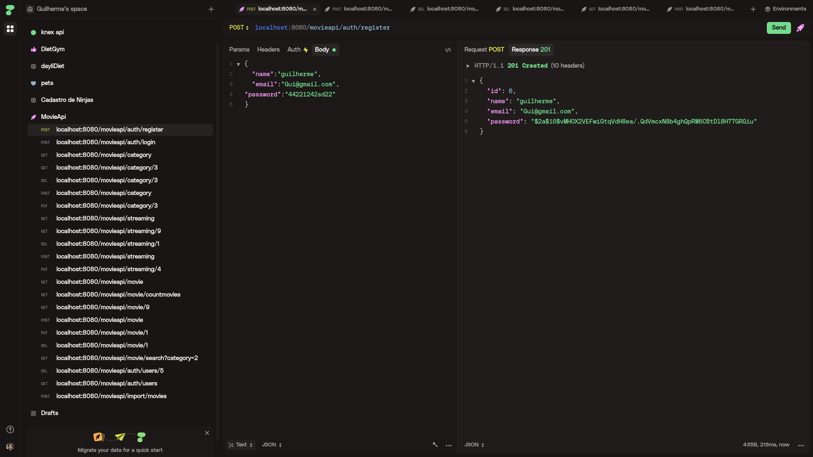
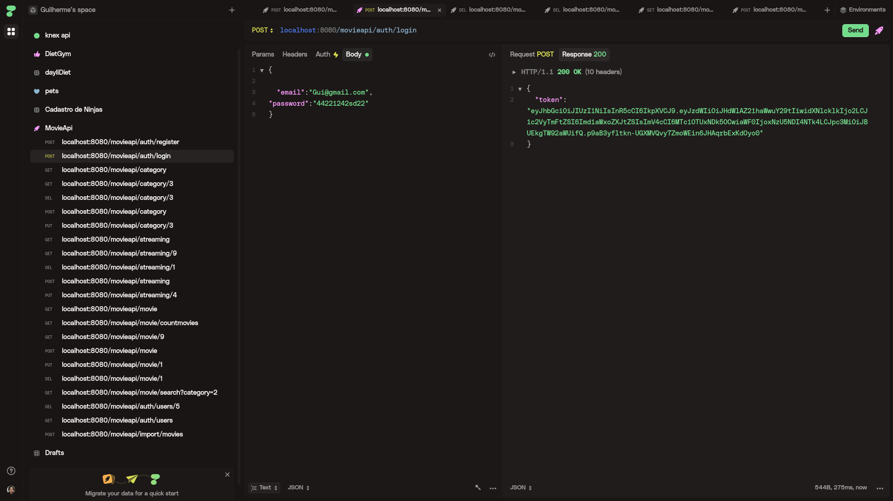
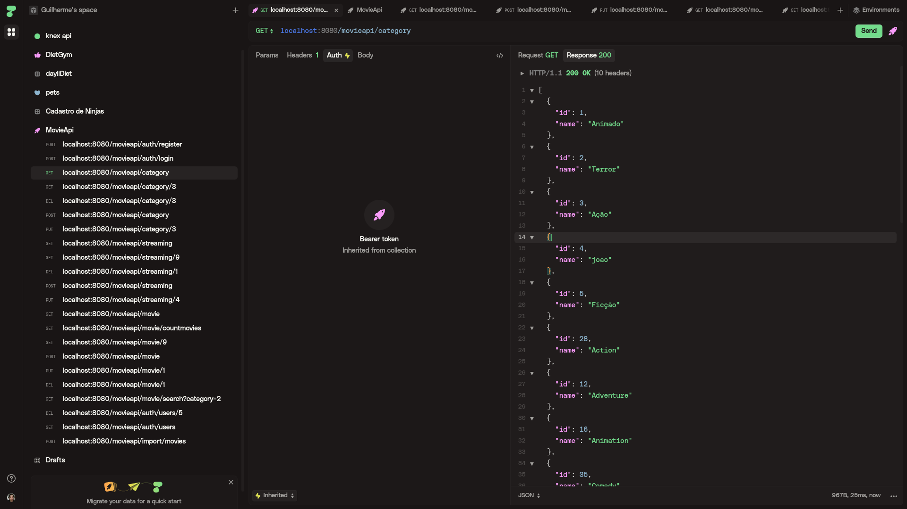
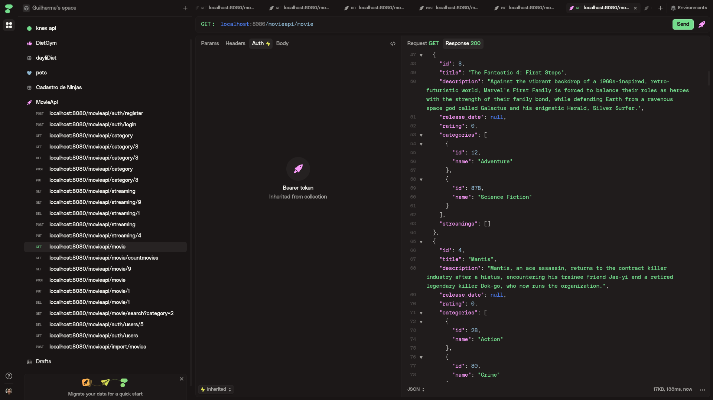
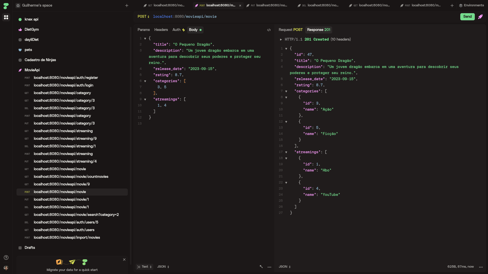
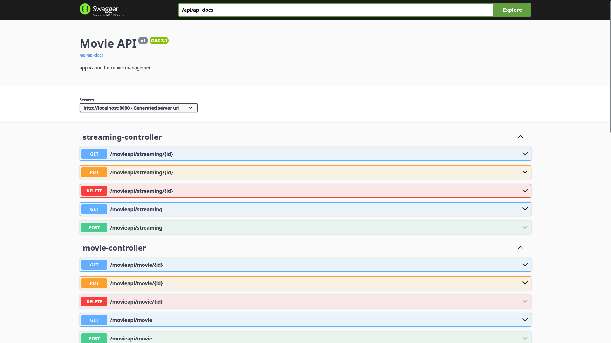
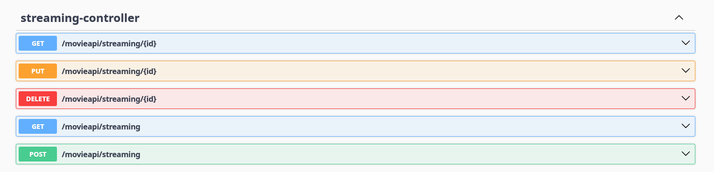
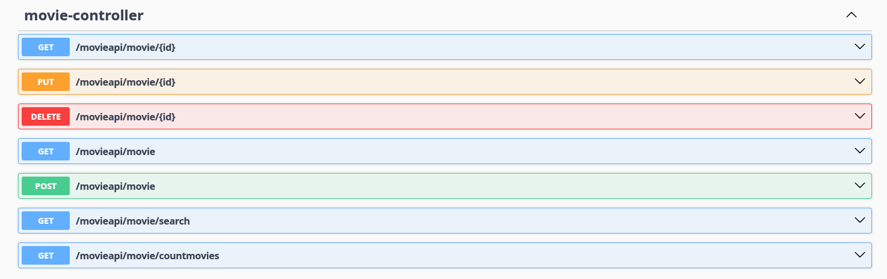
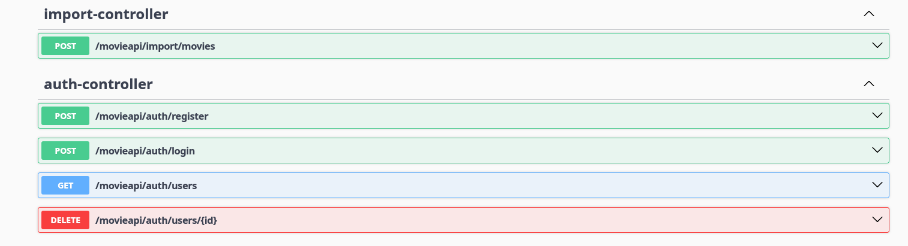

# Movie API


## 🎬 Visão Geral do Projeto

A **Movie API** é uma API RESTful robusta para gerenciamento de um catálogo de filmes. Construída com as tecnologias mais modernas do ecossistema Java, a API oferece um conjunto completo de funcionalidades para administrar filmes, categorias, plataformas de streaming e usuários, incluindo um sistema de autenticação seguro baseado em JWT.

## ✨ Principais Funcionalidades

- **Autenticação e Autorização**: Sistema completo de registro e login de usuários com tokens JWT.
- **Gerenciamento de Filmes**: Operações CRUD completas para filmes.
- **Busca Avançada**: Filtre filmes por categoria.
- **Contagem de Filmes**: Endpoint otimizado para retornar a quantidade de filmes no catálogo.
- **Gerenciamento de Catálogos**: CRUD para categorias e plataformas de streaming.
- **Importação de Dados**: Um endpoint para popular o banco de dados com os filmes mais populares do TMDb.
- **Documentação Interativa**: Documentação completa e testável com Swagger.

## 🛠️ Tecnologias Utilizadas

| Tecnologia | Descrição |
| --- | --- |
| **Java 21** | Linguagem de programação principal. |
| **Spring Boot 3.5.5** | Framework para criação de aplicações Java. |
| **Spring Security** | Para autenticação e autorização. |
| **JPA / Hibernate** | Para persistência de dados e mapeamento objeto-relacional. |
| **PostgreSQL** | Banco de dados relacional. |
| **Flyway** | Para controle de versão do banco de dados (migrations). |
| **Maven** | Gerenciador de dependências. |
| **Lombok** | Para reduzir código boilerplate. |
| **JWT** | Para autenticação baseada em token. |
| **SpringDoc OpenAPI** | Para a documentação da API com Swagger. |

## 🚀 Como Executar

### Pré-requisitos

- Java 21
- Maven 3.8+
- PostgreSQL 14+
- Uma chave de API do [TMDb](https://www.themoviedb.org/settings/api)

### Configuração

1. **Clone o repositório:**
   ```bash
   git clone https://github.com/seu-usuario/movieapi.git
   cd movieapi
   ```
2. **Configure as variáveis de ambiente:**
   - Crie um banco de dados PostgreSQL (ex: `movieapi_db`).
   - No arquivo `src/main/resources/application.yaml`, configure as seguintes propriedades:
     ```yaml
     spring:
       datasource:
         url: jdbc:postgresql://localhost:5432/movieapi_db
         username: SEU_USUARIO_POSTGRES
         password: SUA_SENHA_POSTGRES
     tmdb:
       api:
         key: SUA_CHAVE_DA_API_DO_TMDB
     ```

### Execução

Execute a aplicação com o Maven:

```bash
./mvnw spring-boot:run
```

A API estará disponível em `http://localhost:8080`.

## 📖 Documentação com Swagger

A documentação completa e interativa da API está disponível através do Swagger UI. Após iniciar a aplicação, acesse:

[http://localhost:8080/swagger-ui.html](http://localhost:8080/swagger-ui.html)

## 🌐 Endpoints da API

(Consulte a documentação do Swagger para detalhes sobre os corpos das requisições e respostas.)

### Autenticação (`/movieapi/auth`)

| Método | Endpoint | Descrição |
| --- | --- | --- |
| `POST` | `/register` | Registra um novo usuário. |
| `POST` | `/login` | Autentica um usuário e retorna um token JWT. |
| `GET` | `/users` | Retorna uma lista de todos os usuários. |
| `DELETE` | `/users/{id}` | Deleta um usuário por ID. |

### Filmes (`/movieapi/movie`)

| Método | Endpoint | Descrição |
| --- | --- | --- |
| `GET` | `/` | Retorna uma lista de todos os filmes. |
| `GET` | `/numberMovies` | Retorna a quantidade total de filmes. |
| `GET` | `/{id}` | Retorna um filme por ID. |
| `POST` | `/` | Cria um novo filme. |
| `PUT` | `/{id}` | Atualiza um filme por ID. |
| `DELETE` | `/{id}` | Deleta um filme por ID. |
| `GET` | `/search?category={id}` | Retorna filmes por ID da categoria. |

### Categorias (`/movieapi/category`)

| Método | Endpoint | Descrição |
| --- | --- | --- |
| `GET` | `/` | Retorna todas as categorias. |
| `GET` | `/{id}` | Retorna uma categoria por ID. |
| `POST` | `/` | Cria uma nova categoria. |
| `PUT` | `/{id}` | Atualiza uma categoria por ID. |
| `DELETE` | `/{id}` | Deleta uma categoria por ID. |

### Streamings (`/movieapi/streaming`)

| Método | Endpoint | Descrição |
| --- | --- | --- |
| `GET` | `/` | Retorna todas as plataformas de streaming. |
| `GET` | `/{id}` | Retorna uma plataforma por ID. |
| `POST` | `/` | Cria uma nova plataforma. |
| `PUT` | `/{id}` | Atualiza uma plataforma por ID. |
| `DELETE` | `/{id}` | Deleta uma plataforma por ID. |

### Importação (`/movieapi/import`)

| Método | Endpoint | Descrição |
| --- | --- | --- |
| `POST` | `/movies` | Importa filmes populares do TMDb. |

## 🖼️ Demonstração da API

| | | |
|:---:|:---:|:---:|
|  |  |  |
|  |  |  |
|  |  |  |

